

# 背景

需求：程式編譯，主要編譯 Yocto（低配版 Build Code Server）
預算：4.5 萬

# 零件挑選

## 中央處理器（CPU）

挑選 CPU 有幾個重點，依優先順序分別為：售價（預算）、效能、功耗（耗電量、廢熱量）、C/P 值。

OpenBenchmarking 上搜集了各型號 CPU 的 [Linux Kernel 編譯時間](https://openbenchmarking.org/test/pts/build-linux-kernel)，可用以評估各型 CPU 多核心編譯的效能：
<!-- more -->


伺服器版的 CPU 太貴，直接跳過。[AMD Ryzen™ 9 5950X](https://www.amd.com/en/products/cpu/amd-ryzen-9-5950x)、[AMD Ryzen™ 9 3950X](https://www.amd.com/en/products/cpu/amd-ryzen-9-3950x) 及 [Intel® Core™ i9-10980XE](https://ark.intel.com/content/www/us/en/ark/products/198017/intel-core-i9-10980xe-extreme-edition-processor-24-75m-cache-3-00-ghz.html) 這三顆 CPU 是目前家用主機的頂規。

Intel 這顆效能表現與 AMD 這二顆相伯仲，但功耗高很多，所以先剔除。再來因為 5950X 和 3950X 這二顆都缺貨，也只能放棄。繼續往下的選擇中，[AMD Ryzen™ 9 5900X](https://www.amd.com/en/products/cpu/amd-ryzen-9-5900x) 效能相差不大，有貨，且 C/P 值比 5950X、3950X 都高很多，因此沒有什麼懸念，就選它了。

## 主機板

相容 AMD Ryzen™ 9 5900X AM4 規格且有現貨的晶片組有 B450、X470、[A520](https://www.amd.com/en/chipsets/a520)、[B550](https://www.amd.com/en/chipsets/b550) 和 [X570](https://www.amd.com/en/chipsets/x570)。符合目前需求的最便宜選擇是 B450，但可惜目前 Mini-ITX 的版本缺貨，只能往更高階看。因為想保留未來插高階顯示卡和 PCIe 4.0 SSD 的空間，所以從 B550 和 X570 之間選了比較便宜的 B550。

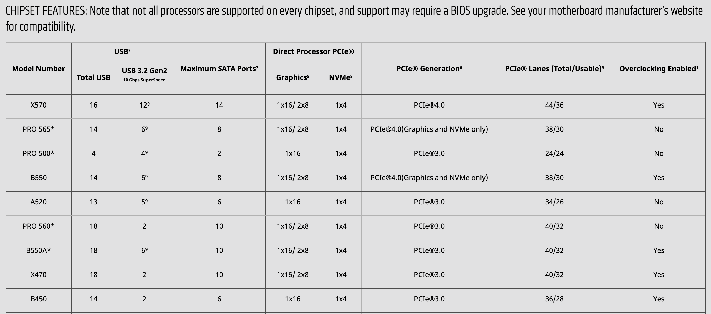


各家 B550 Mini-ITX 主機板評測：



## 記憶體

依照過去編譯 AOSP 的經驗，編譯所需的記憶體大小，約略是 CPU 執行緒數多少條，記憶體就要多少 GB。除此之外，我也先在舊的電腦上，參考這個[網頁](https://www.linuxatemyram.com/)，分別在掛上 Swap 和卸載 Swap 的情形下實際編譯 Yocto 專案，來比較記憶體的使用狀況。

測試機器：

- Intel® Core™ i7-8700K (6 核、12 緒)

```
$ lscpu
Architecture:        x86_64
CPU op-mode(s):      32-bit, 64-bit
Byte Order:          Little Endian
CPU(s):              12
On-line CPU(s) list: 0-11
Thread(s) per core:  2
Core(s) per socket:  6
Socket(s):           1
...
```

- 記憶體 16 GB

```
$ free
              total        used        free      shared  buff/cache   available
Mem:       16303912     1840356    13280940      873236     1182616    13286976
Swap:       2097148           0     2097148
```

1.  有掛載 Swap：
    掛 Swap：
    
    ```
    swapon -a
    ```
    
    清記憶體：
    
    ```
    sync; echo 3 | sudo tee /proc/sys/vm/drop_caches
    ```
    
    開始搜集記憶體使用狀況：
    
    ```
    free -s 1 | tee memory-usage-log-swapon.txt
    ```
    
    進行編譯。
    完成後確認，編譯過程中最低可用記憶體剩餘量：
    
    ```
    grep Mem  memory-usage-log-swapon.txt | awk '{print $7}' | sort -n | head -n 1
    ```
    
    及最高 Swap 使用量：
    
    ```
    grep Swap  memory-usage-log-swapon.txt | awk '{print $3}' | sort -nr | head -n 1
    ```
    
    最低可用記憶體剩餘量為 5.46 GB，最高 Swap 使用量為 321.75 MB。因此在 12 緒的 CPU 下編譯我的 Yocto 專案，搭配 16 GB 的記憶體是足夠的。本次編譯耗時 1:06:13.27。
    
2.  無掛載 Swap：
    卸 Swap：
    
    ```
    swapoff -a
    ```
    
    清記憶體：
    
    ```
    sync; echo 3 | sudo tee /proc/sys/vm/drop_caches
    ```
    
    開始搜集記憶體使用狀況：
    
    ```
    free -s 1 | tee memory-usage-log-swapoff.txt
    ```
    
    進行編譯。
    完成後確認，編譯過程中最低可用記憶體剩餘量：
    
    ```
    grep Mem memory-usage-log-swapoff.txt | awk '{print $7}' | sort -n | head -n 1
    ```
    
    最低可用記憶體剩餘量為 5.24 GB，與開頭的經驗，編譯中 1 條執行緒約需 1 GB 相符。本次編譯耗時 1:06:10.88。

AMD Ryzen™ 9 5900X AM4 是 12 核 24 緒，因此 32 GB 的記憶體應足夠使用。同樣大小的記憶體也有價差，時脈、CL 值、會不會發光、品牌等都有影響。這次買了 DDR4-3600 CL18，其實應該選 DDR4-3200 CL16 的就好，因為二者效能差不多，但 DDR4-3600 CL18 的價格高了近 20%。這邊預算沒有控制好。

DDR4-3200 vs. DDR4-3600 評測：



## 固態硬碟（SSD）

儲存空間大一點比較方便，目前有貨的最大大小為 2 TB，[WD_BLACK™ SN750](https://shop.westerndigital.com/products/internal-drives/wd-black-sn750-nvme-ssd#WDS250G3X0C) 太貴，就挑了使用國產控制器（群聯）一樣五年保的 [Pioneer APS-SE20Q](https://pioneer-iot.com/product/internal-ssd/internal-ssdaps-se20q/)。

## 顯示卡

基本上這臺電腦除了安裝 OS 以外都不會接螢幕，因此低階的即可。但仍希望起碼能推動 4K 的螢幕看影片，所以挑了 [GeForce GT 1030](https://www.nvidia.com/en-us/geforce/graphics-cards/gt-1030/specifications/)。

沒買到 GDDR5 的版本有點可惜，沒差多少錢，但效能差很多：



## 機殼

目前使用的 [SilverStone SG09](https://www.silverstonetek.com/legacy.php?pid=345&area=tw&model=SG09&tno=) 搭配貓頭鷹塔散，機殼尺寸和散熱效果都讓我很滿意。因為小機殼輕巧的特性，這次鎖定 Mini-ITX 的機殼。小機殼內部比較擁擠，裝高度發熱的元件要特別注意通風、散熱。參考了一些在 YouTube 上看到的機殼：






發現符合我期待的散熱方式及電源位置的只有 [NZXT H210](https://nzxt.com/product/h210)，所以就選了它。


挑選小型的機殼時，除了要注意 CPU 散熱器的高度外，還要看散熱器的體積對機殼內通風的影響。H210 的內部配置有一些亮點：

1.  前進氣風扇的尺寸比後出風風扇的大，因此很容易可以達到機殼內正壓的配置。
2.  風流設計看起來很合理，前方進風後方出風，中間會吹到 CPU、顯示卡和電源。
3.  有附防塵濾網。
4.  電源下置且有獨立空間。
5.  可使用 ATX (PS/2) 標準的電源。
6.  電源直接貼在背板，電源線可以直接接到電源上，不需要透過機殼自帶的電源延長線。

像這種小型的機殼，因為顯卡離機殼底部很近，因此還要注意，若機殼下方會裝風扇，其風向應與顯卡風扇的風向一致。不是所有顯卡的風扇都是往晶片方向吹的，也有反著吹的：


補充說明，我會避免選擇將電源供應器定位為主要排風元件的機殼（如後上置型的）。因為電源供應器很怕熱，長期在較熱環境中工作的電源供應器，除了壽命比較短之外，也很危險（可參見全漢[官網說明](https://www.fsp-group.com/tw/knowledge-prd-4.html)）。機殼內有獨立空間可放置電源供應器是最理想的，這樣電源供應器就不會與 CPU、顯示卡等高發熱元件混在同一空間內；退而求其次，也要讓這三者有獨立的風道，這樣三者產生的熱才不會互相影響。

## CPU 散熱器

散熱器的選擇實在太多了，所以我直接在以安靜著稱的貓頭鷹裡挑。因為希望能與機殼設計的水平風流相配合，所以只看塔式散熱器。5900X 蠻熱的，需要散熱能力好一點的，同時我又不喜歡記憶體完全被散熱器遮住看不到，所以挑了 [Noctua NH-D15S](https://www.google.com/search?client=firefox-b-d&q=NH-D15s)。

Mini-ITX 主板 + 記憶體 + NH-D15S 示意圖：


NZXT H210 + NH-D15S 示意圖：


## 電源供應器

電源供應器是耗材，它的供應瓦數是會衰減的。預算許可的話，就把瓦數買到 CPU + 顯卡功耗的 2 倍，這樣電源供應器在其他零件壞掉前應該都會是好的。愛護地球，在能負擔的範圍內選轉換功率高一點的。如果機殼支援 ATX 規格的電源供應器，那在電源供應器的選擇會比較多，也會比較便宜。

# 組裝

*開車就是要開手排才熱血，電腦就是要自己裝才有靈魂。*

開始前，先說明一個注意事項：除了一些非通用特殊螺絲之外，一部電腦主機裡的螺絲有 3 種不同的螺絲牙，這三種螺絲牙通常是，最粗的（kb5）鎖風扇，中等的（#6-32 UNC）鎖主機板、機殼、電源，最細的（M3）鎖硬碟。除此之外，也要注意螺絲頭，有些適合用平頭、有些適合用寬頭、有些適合用手擰的等等。詳請見維基百科 [Computer case screws](https://en.wikipedia.org/wiki/Computer_case_screws)。

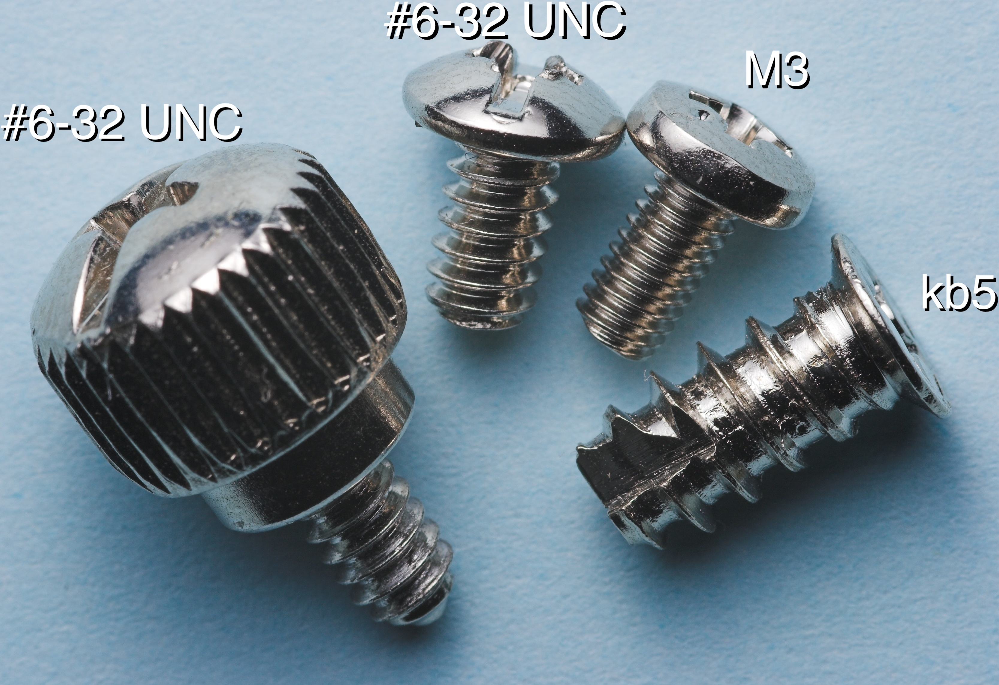

全零件合照（這邊缺了 SSD 和 後置薄扇）：


拿出工具盒，正式開始。

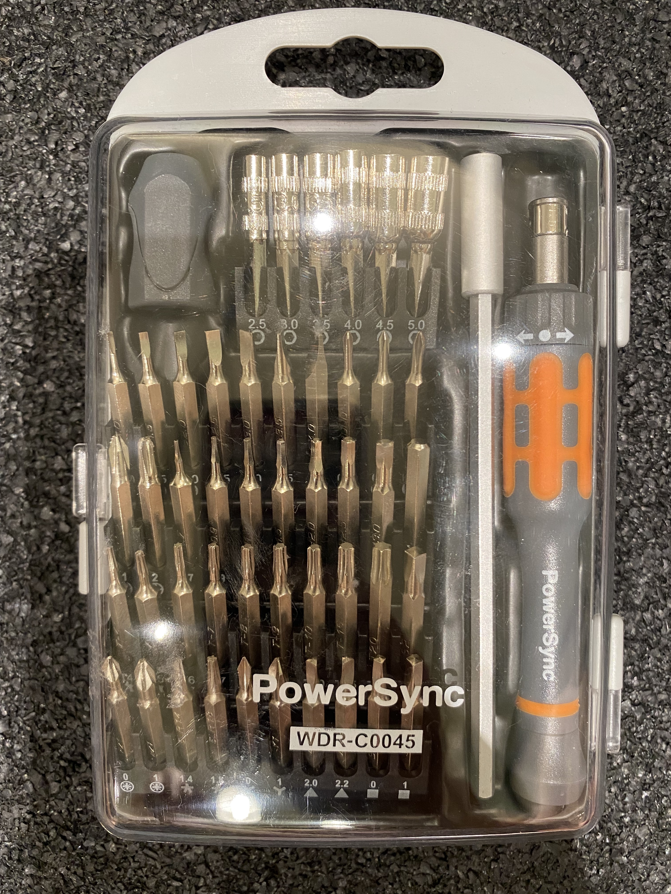

## 安裝電源供應器及機殼風扇

1. 把電源供應器裝進機殼後下方
    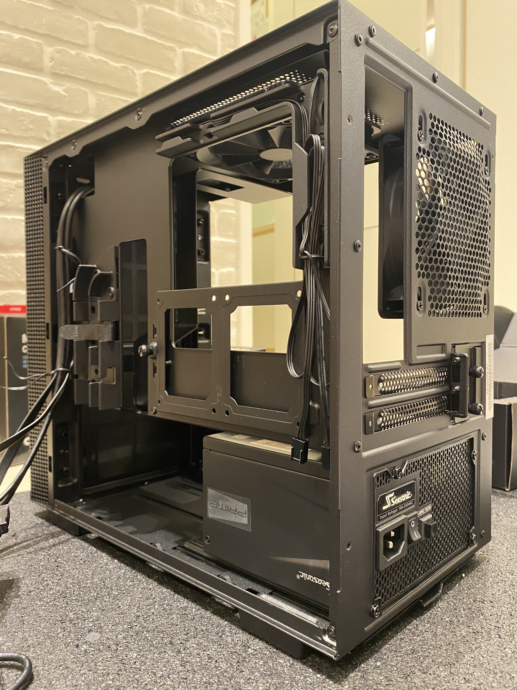
2. 將 2 顆 14" 進風扇裝進機殼前方
    

**Update**

之後為防落塵，上方出風口用黑色不織布封住：


另購了貓頭鷹 NF-A12x15 薄扇 1 個裝在機殼後方出風。


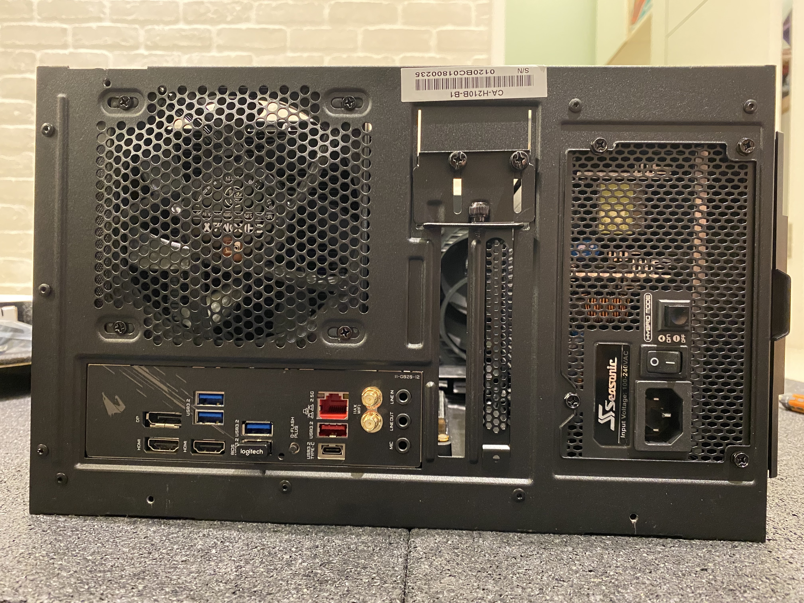


**Update 2**

實測後發現 NF-A12x15 對降低峰值溫度沒什麼效果，同時產生了低頻的共鳴噪音，所以後來又把它拆掉了。

## 安裝 CPU

1. 首先核對 CPU 安裝方向的標示
    
2. 拉起 CPU 固定桿並輕輕放下 CPU
    
3. 放下固定桿，確定 CPU 有被夾緊
    

## 安裝 NVMe SSD

補拍 SSD 照片


B550 不是所有 NVMe 插槽都是 PCIe 4.0，所以要注意一下。不過因為買的是 PCIe 3.0 的 SSD，所以也沒差。

1. 從腳位判斷安裝方向
    
2. 斜斜地插入 SSD
    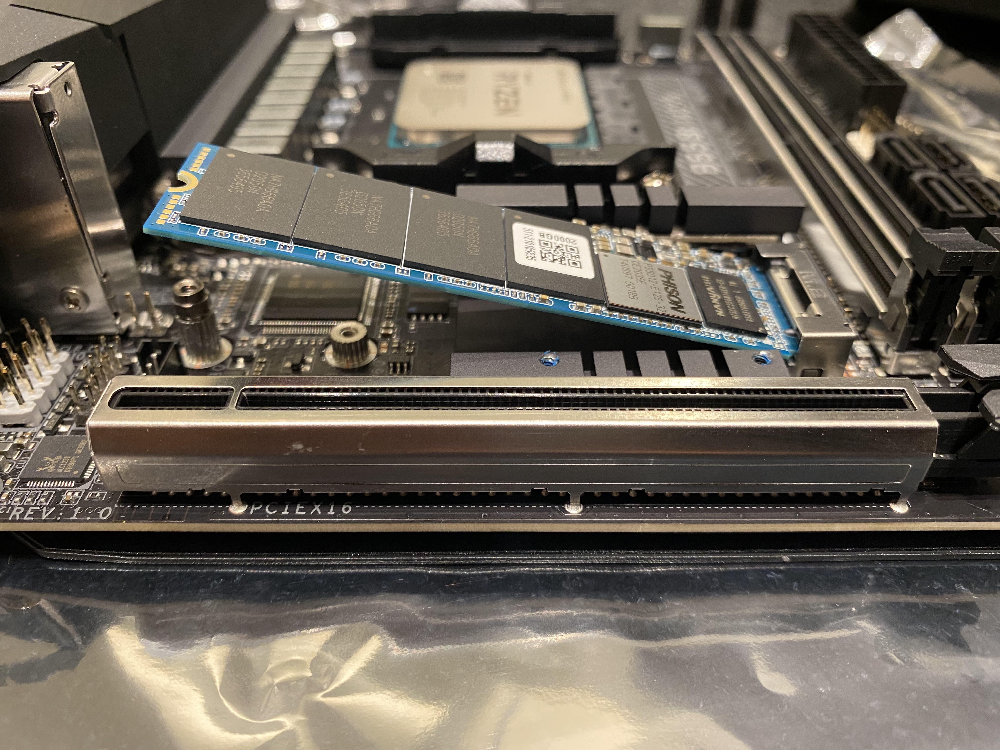
3. 用六角套筒卸下主機板上的固定用螺母柱
    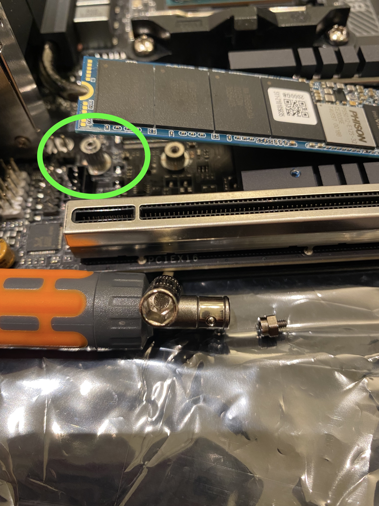
4. 將 SSD 壓平，並用螺母柱加以固定
    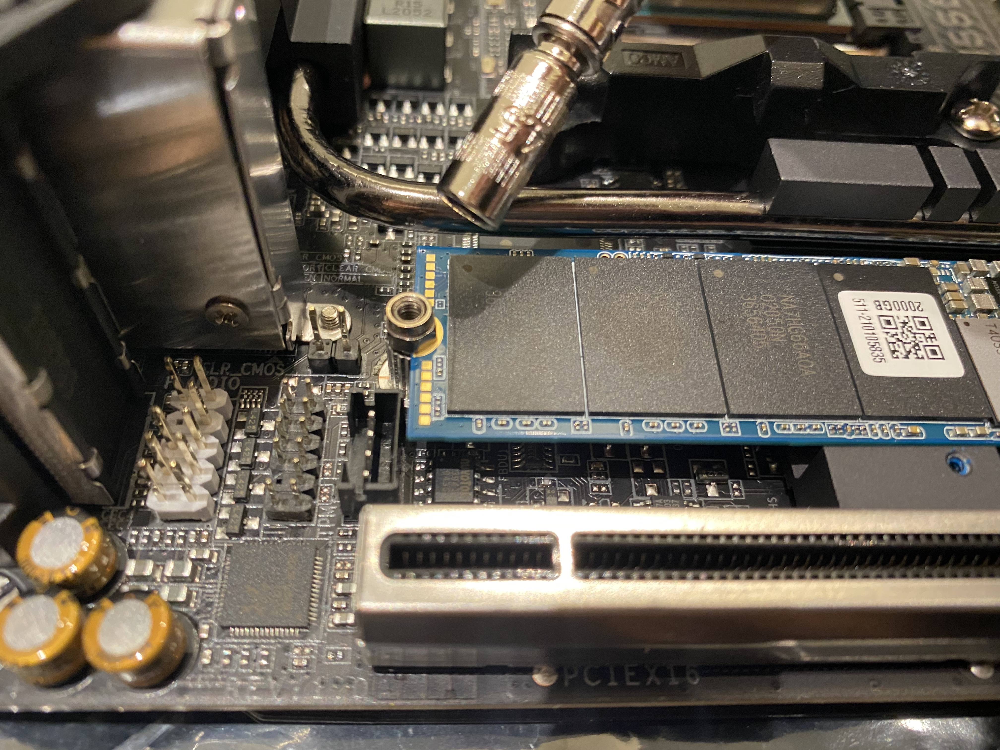
5. 撕開 SSD 散熱片的背膠
    
6. 將 SSD 散熱片放至定位，並鎖上螺絲固定
    
    

## 安裝記憶體

1. 扳開記憶體插槽二側的卡榫
    
2. 確認記憶體插銷缺口位置
    
3. 垂直壓下記憶體直到二側卡榫卡緊記憶體
    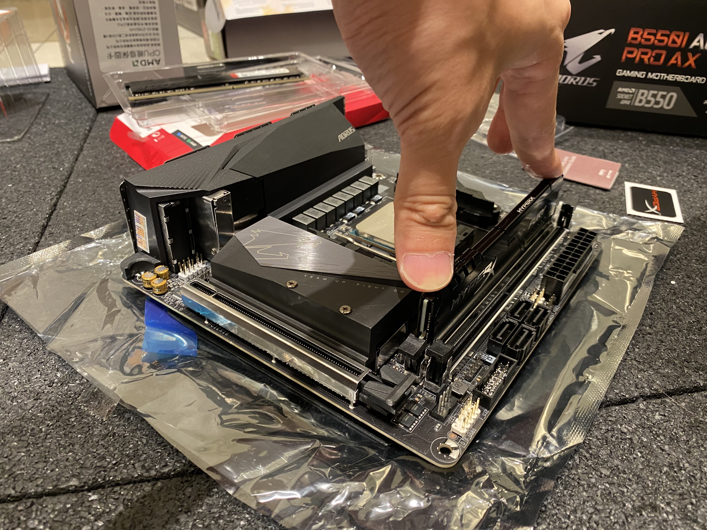

## 安裝 CPU 散熱器

1. 卸下原廠散熱器基座
    
2. 留下散熱器加固背板
    
    
3. 比對散熱器方向
    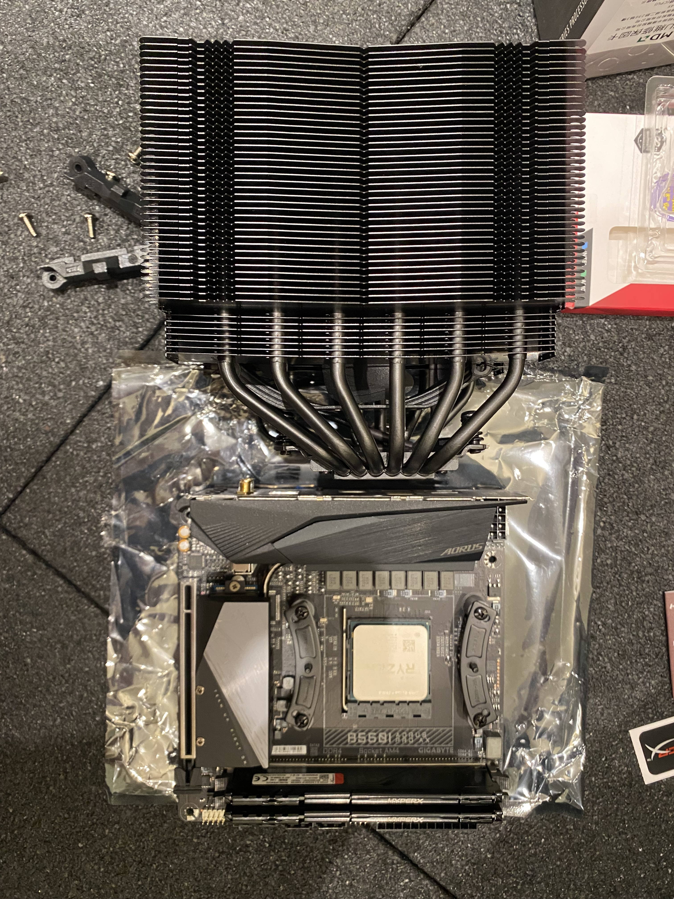
4. 安裝散熱器基座
5. 點散熱膏。於 CPU 中心點上一球直徑約 0.5 cm 的量。
    
6. 鎖上散熱鰭片
    
7. 鎖緊散熱鰭片後，從與 CPU 的接縫處檢查散熱膏是否適量。應該要稍微有一點散熱膏被壓出來，但量不要多到會沾到主機板。
    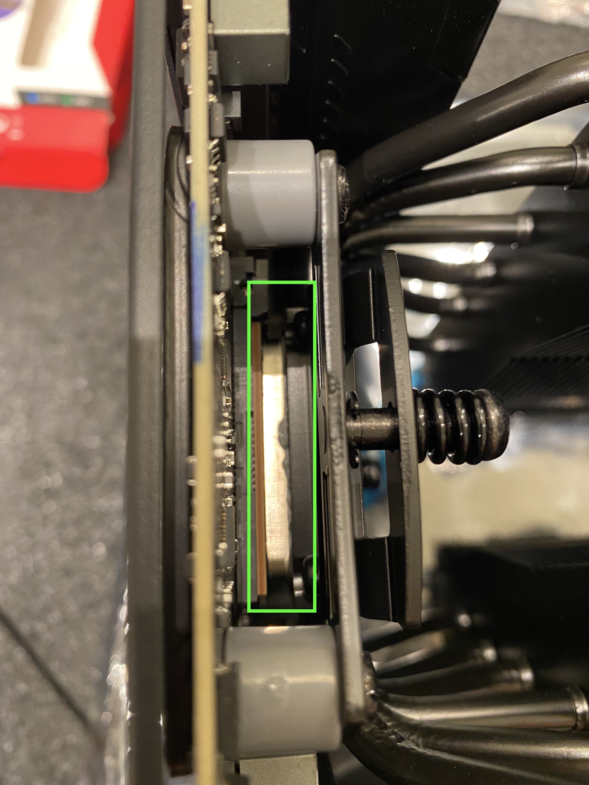
8. 調整散熱器風扇方向
    
9. 接上 CPU 散熱風扇電源
    

完成。可以看到 NH-D15s 給記憶體相當大的空間：


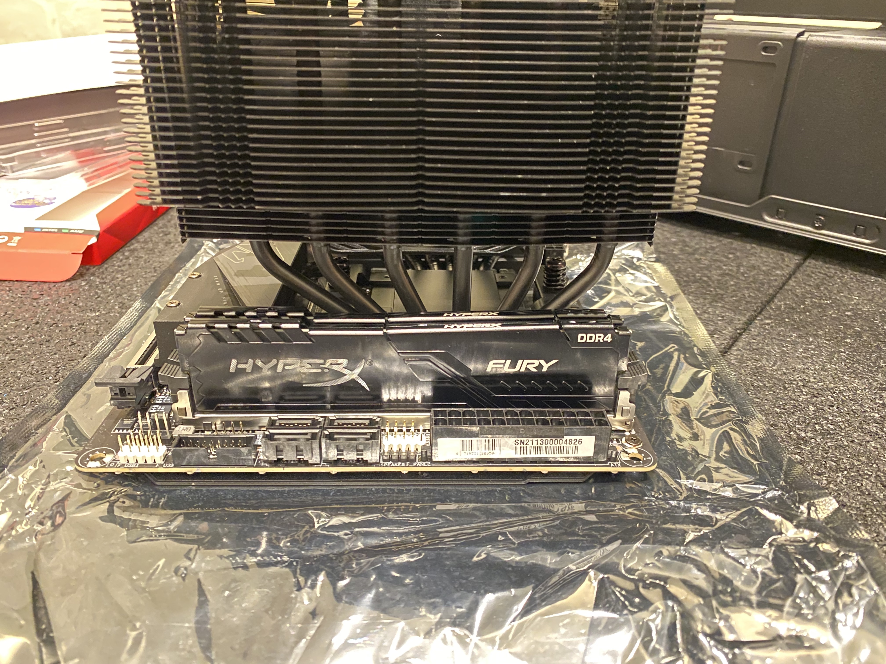

散熱鰭片的長、寬沒有超出主機板：

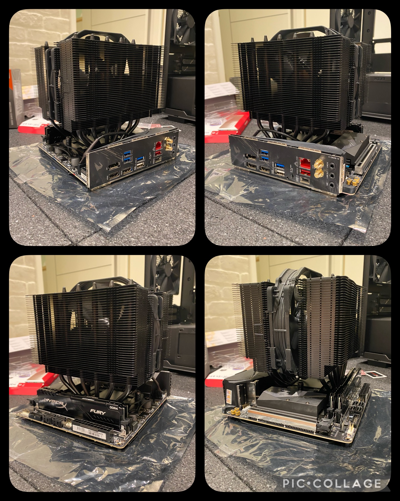

## 安裝主機板

準備放主機板進機殼時，才發現散熱鰭片會卡到這款機殼後面和上面的風扇，只好把它們拆掉。


1. 接上 CPU 電源
2. 將主機板放至定位，以螺絲固定
    
    左上角的螺絲孔被 CPU 散熱鰭片擋住鎖不到，要能鎖到的話，就要先裝主機板再裝鰭片。但因為先鎖主板再裝鰭片會不能檢查散熱膏的量，加上這張主板背面有金屬框加固應該夠堅固，所以就不重做了。
3. 接上其他各種電源
    

## 安裝顯示卡

低階顯卡不用額外接電源，直接插到對應的槽並鎖上機殼背板就好。


## 理線

理線是一個耗時也不見得做得好的工作，建議動手前先參考別人的做法。對外觀講究的話，可以另外購買高顏值的訂製線。網路上搜尋「機殼型號」 + 「Cable Management」就可以看到很多範例。


## 完成

最後蓋上機殼側板，就完成啦！


# 驗收

## CPU 效能

相同專案在新電腦的編譯時間約為 35 分鐘，在上面列的 i7-8700K 舊電腦約為 66 分鐘。CPU 執行緒數加倍，時間約減半，算是符合預期。

CPU 頻率在編譯過程中，穩定維持在 4.3 GHz ~ 4.5 GHz 之間，與網路上的[評測](https://www.techpowerup.com/review/amd-ryzen-9-5900x/21.html)非常接近，沒有因為過熱而降頻。


## 記憶體用量

編譯過程中，這臺 24 緒的電腦可用記憶體高達 20 GB 左右，也就是說編譯過程中，有用到的記憶體約 12 GB。但在舊電腦 12 緒的 CPU 上編譯也是只用了 12 GB 左右。這個結果說明了執行緒數目和記憶體用量成正比是錯誤的假設 😅

## CPU 溫度

環境溫度 28 °C、空調


1. 後、上出風風扇都沒裝
    待機：約 33 °C
    峰值：80.4 °C
2. 後出風風扇沒裝、上方出風口封起
    待機：約 33 °C
    峰值：81.9 °C
    
3. 後出風風扇 NF-A12x15 、上方出風口封起
    待機：約 33 °C
    峰值：81.9 °C
    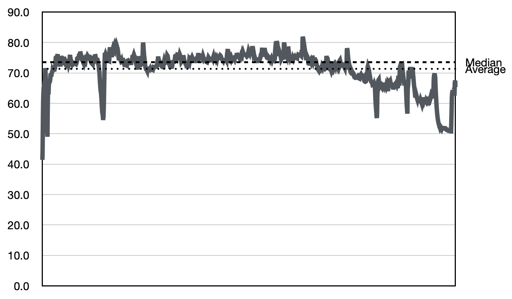

由此可以看到，在這個環境溫度、機殼內配置下，上方出風口和後出風風扇對散熱的影響都不大。
