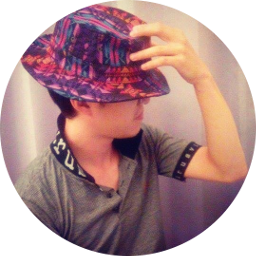

title: About the Author
comments: false
---

A senior Android app developer. Besides Java, he is also good at Bash, C and Python. Interested in programming competitions related to algorithms.

&nbsp;&nbsp;&nbsp;&nbsp;&nbsp;&nbsp;

